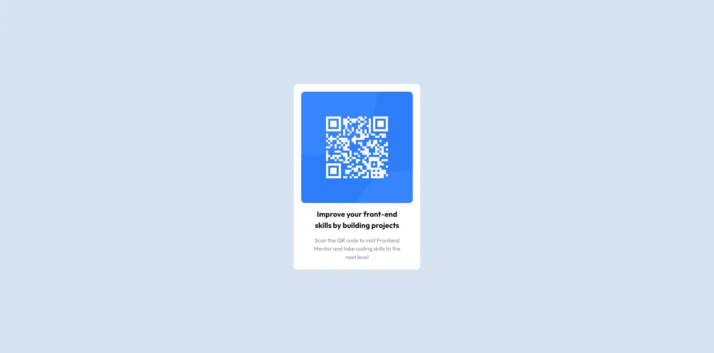

# Frontend Mentor - QR code component solution

This is my solution to the [QR code component challenge on Frontend Mentor](https://www.frontendmentor.io/challenges/qr-code-component-iux_sIO_H).

## Table of contents

- [Overview](#overview)
  - [Screenshot](#screenshot)
  - [Links](#links)
- [My process](#my-process)
  - [Built with](#built-with)
  - [What I learned](#what-i-learned)
  - [Useful resources](#useful-resources)
- [Author](#author)

## Overview

### Screenshot



### Links

- Challenge resource URL: [Frontend Mentor - QR Code Challenge](https://your-solution-url.com)
- Live Site URL: [Github pages](https://your-live-site-url.com)

## My process

### Built with

- Semantic HTML5 markup
- SCSS custom properties
- Flexbox
- [Vite](https://vitejs.dev/) - Bundle tool

### What I learned

I learn something about Sass Nesting and Sass styleing. Also i learn mixins and variables.

```Sass
.box {
  @include Radius;
  @include FlexCenter;
  &__container {
    min-height: 50rem;
    padding: 2rem;
    background-color: white;
  }
  &__code--img {
    max-width: 30rem;
  }
  &__wrapper {
    max-width: 25rem;
  }
}
```

### Useful resources

- [Sass Doc](https://sass-lang.com/documentation/style-rules) - This helped me for push my skill in Sass and nesting little bit more.

## Author

- Website - [Nimixx](https://www.your-site.com)
- Frontend Mentor - [@Nimixx](https://www.frontendmentor.io/profile/Nimixx)
